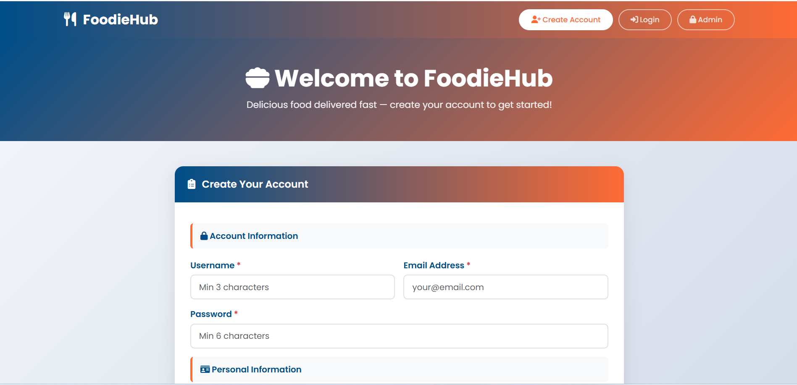
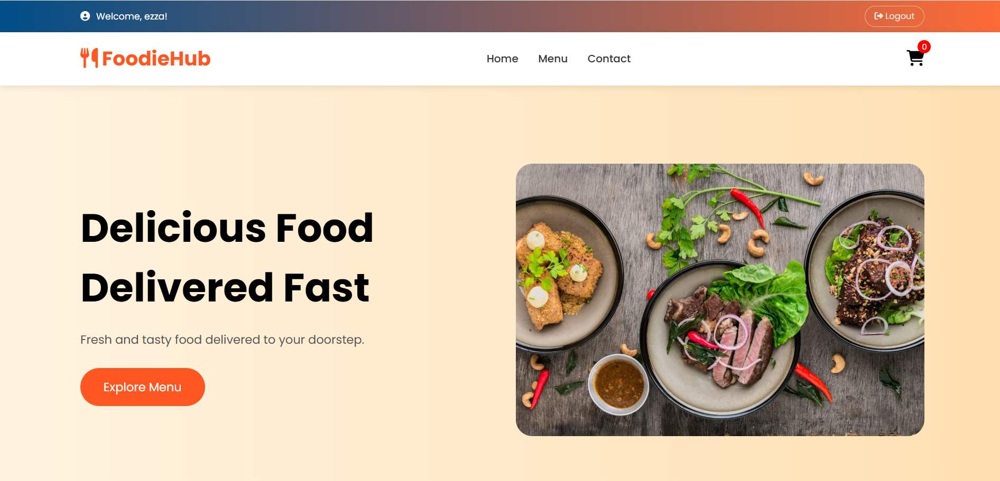
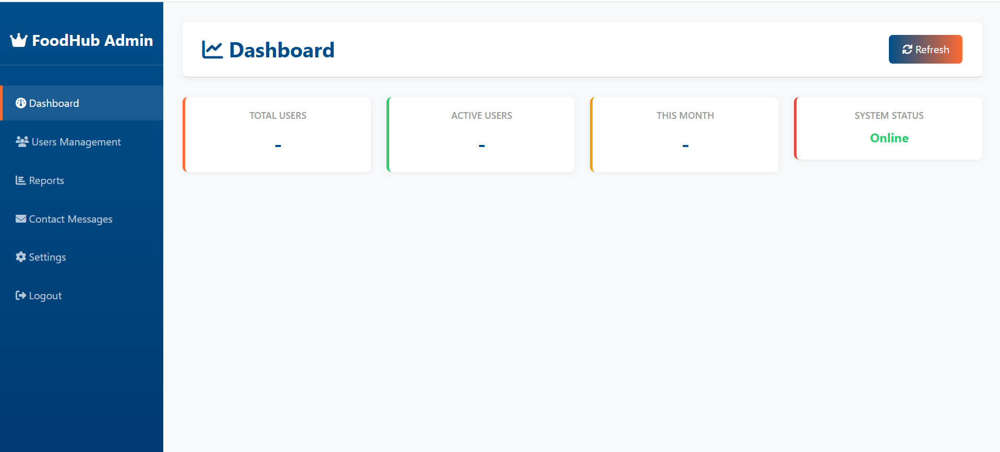
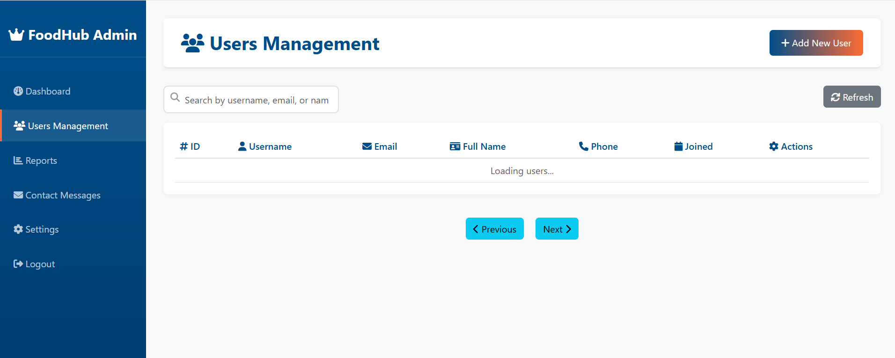

# 🍔 FOODIES - Food Ordering Web Application

A full-stack food ordering web application developed using **Node.js, Express.js, MongoDB, EJS, Bootstrap, HTML, CSS, and JavaScript**. The application provides separate **User** and **Admin** dashboards, offering a complete food ordering experience along with an admin management system powered by CRUD operations.

---

## 📌 Project Overview

FOODIES is designed to simplify the online food ordering process. Customers can browse the menu, view food items, and place orders through an intuitive interface, while administrators can efficiently manage the application's content through a dedicated dashboard.

The project follows the **MVC (Model-View-Controller)** architecture, making the code organized, scalable, and easier to maintain.

---

## ✨ Features

### 👤 User Dashboard

* Browse available food items
* View food details
* Responsive and user-friendly interface
* Add to cart food items
* Place food orders
* Simple navigation

### 👨‍💼 Admin Dashboard

* Add new food items
* View all food items
* Update existing food details
* Delete food items
* Complete CRUD functionality
* Manage menu efficiently

---

## 🛠️ Tech Stack

### Frontend

* HTML5
* CSS3
* Bootstrap
* JavaScript
* EJS

### Backend

* Node.js
* Express.js

### Database

* MongoDB
* Mongoose

---

## 📂 Project Structure

```text
FOODIES/
│
├── controllers/
├── models/
├── routes/
├── views/
├── public/
│   ├── css/
│   ├── js/
│   └── images/
├── config/
├── app.js
├── package.json
├── .gitignore
└── README.md
```

---

## 🚀 Installation

### 1. Clone the repository

```bash
git clone https://github.com/YourUsername/FOODIES.git
```

### 2. Navigate to the project folder

```bash
cd FOODIES
```

### 3. Install dependencies

```bash
npm install
```

### 4. Configure environment variables

Create a `.env` file in the project root and add the required environment variables, such as:

```env
PORT=3000
MONGODB_URI=your_mongodb_connection_string
```

### 5. Start the application

```bash
npm start
```

or

```bash
node app.js
```

### 6. Open your browser

```
http://localhost:3000
```

---

## 📸 Screenshots

### Login/Signup Page


### Home Page


### Admin Dashboard


### CRUD Operations


---

## 📚 CRUD Operations

The Admin Dashboard provides complete CRUD functionality:

* ➕ Create new users
* 📖 Read/View all users
* ✏️ Update existing users
* 🗑️ Delete users

---

## 🏗️ Architecture

The application follows the MVC architecture:

* **Model** – Handles database operations.
* **Controller** – Processes requests and business logic.
* **Routes** – Defines application endpoints.

---

## 💡 Learning Outcomes

This project helped strengthen practical knowledge of:

* Full-stack web development
* RESTful routing
* MVC architecture
* Express.js
* MongoDB integration
* CRUD operations
* Responsive web design
* Backend development using Node.js

---

## 🔮 Future Improvements

* User authentication and authorization
* Shopping cart functionality
* Online payment integration
* Order history
* Search and filter options
* Customer reviews and ratings
* Email notifications
* Image upload for food items
* Deployment on a cloud platform

---

## 🤝 Contributing

Contributions, suggestions, and improvements are welcome. Feel free to fork the repository and submit a pull request.

---

## 📄 License

This project is created for educational and learning purposes.

---

## 👨‍💻 Author

**Raila Shaukat**

GitHub: https://github.com/YourUsername

---

⭐ If you found this project useful, consider giving it a star on GitHub!
